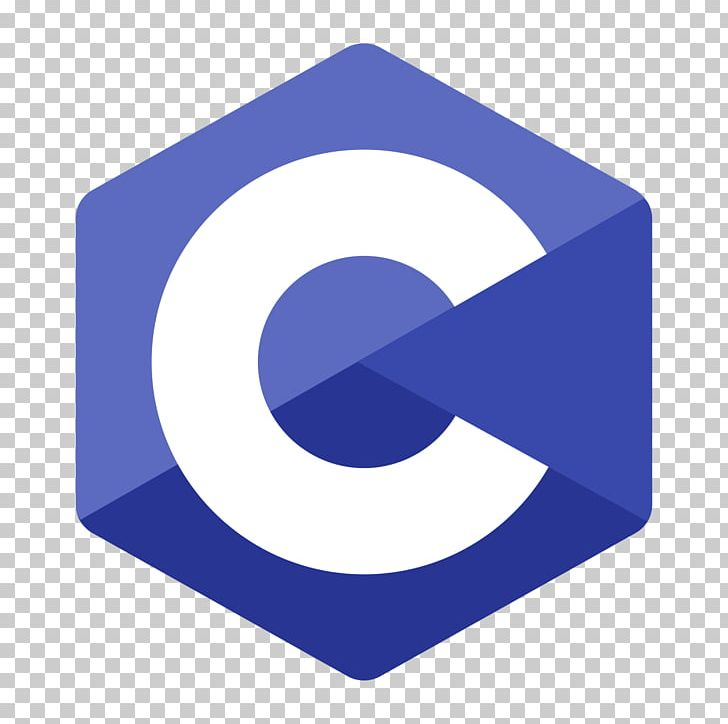

[](https://github.com/vn7n24fzkq/github-profile-summary-cards)
[](https://github.com/vn7n24fzkq/github-profile-summary-cards) [](https://github.com/vn7n24fzkq/github-profile-summary-cards)
[](https://github.com/vn7n24fzkq/github-profile-summary-cards) [](https://github.com/vn7n24fzkq/github-profile-summary-cards)


<!--START_SECTION:waka-->


**🐱 My GitHub Data** 

> 📦 17.1 kB Used in GitHub's Storage 
 > 
> 🏆 46 Contributions in the Year 2024
 > 
> 🚫 Not Opted to Hire
 > 
> 📜 7 Public Repositories 
 > 
> 🔑 2 Private Repositories 
 > 
**I'm an Early 🐤** 

```text
🌞 Morning                2 commits           █░░░░░░░░░░░░░░░░░░░░░░░░   04.44 % 
🌆 Daytime                41 commits          ███████████████████████░░   91.11 % 
🌃 Evening                2 commits           █░░░░░░░░░░░░░░░░░░░░░░░░   04.44 % 
🌙 Night                  0 commits           ░░░░░░░░░░░░░░░░░░░░░░░░░   00.00 % 
```


📊 **This Week I Spent My Time On** 

```text
🕑︎ Time Zone: Asia/Kolkata

💬 Programming Languages: 
JavaScript               2 hrs 23 mins       █████████████░░░░░░░░░░░░   52.84 % 
Go                       1 hr 21 mins        ███████░░░░░░░░░░░░░░░░░░   29.98 % 
JSON                     18 mins             ██░░░░░░░░░░░░░░░░░░░░░░░   06.91 % 
NSIS                     17 mins             ██░░░░░░░░░░░░░░░░░░░░░░░   06.32 % 
Other                    6 mins              █░░░░░░░░░░░░░░░░░░░░░░░░   02.26 % 

🔥 Editors: 
VS Code                  4 hrs 31 mins       █████████████████████████   100.00 % 

🐱‍💻 Projects: 
Dank-Memer-Grinder       1 hr 37 mins        █████████░░░░░░░░░░░░░░░░   36.06 % 
Dbot                     1 hr 29 mins        ████████░░░░░░░░░░░░░░░░░   32.97 % 
Donkzz                   56 mins             █████░░░░░░░░░░░░░░░░░░░░   20.99 % 
Unknown Project          14 mins             █░░░░░░░░░░░░░░░░░░░░░░░░   05.33 % 
dankgrinder-2.1.0        6 mins              █░░░░░░░░░░░░░░░░░░░░░░░░   02.53 % 

💻 Operating System: 
Windows                  4 hrs 31 mins       █████████████████████████   100.00 % 
```

**I Mostly Code in JavaScript** 

```text
JavaScript               1 repo              ████████░░░░░░░░░░░░░░░░░   33.33 % 
CSS                      1 repo              ████████░░░░░░░░░░░░░░░░░   33.33 % 
Python                   1 repo              ████████░░░░░░░░░░░░░░░░░   33.33 % 
```


 Last Updated on 21/12/2024 18:38:52 UTC
<!--END_SECTION:waka-->

[](https://spotify-github-profile.kittinanx.com/api/view?uid=31pybieniezipiyqstyr662wni5u&redirect=true)
### Languages

<p align="left">
  <a href="#">
      
  </a>  
  <a href="#">
      
  </a>
  <!-- <a href="#">
      
  </a> -->
</p>  


### Socials
<p align="left">
  <a href="https://discordapp.com/users/517895546283753494">
      
  </a>  
  <a href="https://open.spotify.com/user/31pybieniezipiyqstyr662wni5u?si=1f5a6969e37f43b1">
      
  </a>
</p>  
Just staring
<!--
**dxrshxnw/dxrshxnw** is a ✨ _special_ ✨ repository because its `README.md` (this file) appears on your GitHub profile.

Here are some ideas to get you started:

- 🔭 I’m currently working on ...
- 🌱 I’m currently learning ...
- 👯 I’m looking to collaborate on ...
- 🤔 I’m looking for help with ...
- 💬 Ask me about ...
- 📫 How to reach me: ...
- 😄 Pronouns: ...
- ⚡ Fun fact: ...
-->
